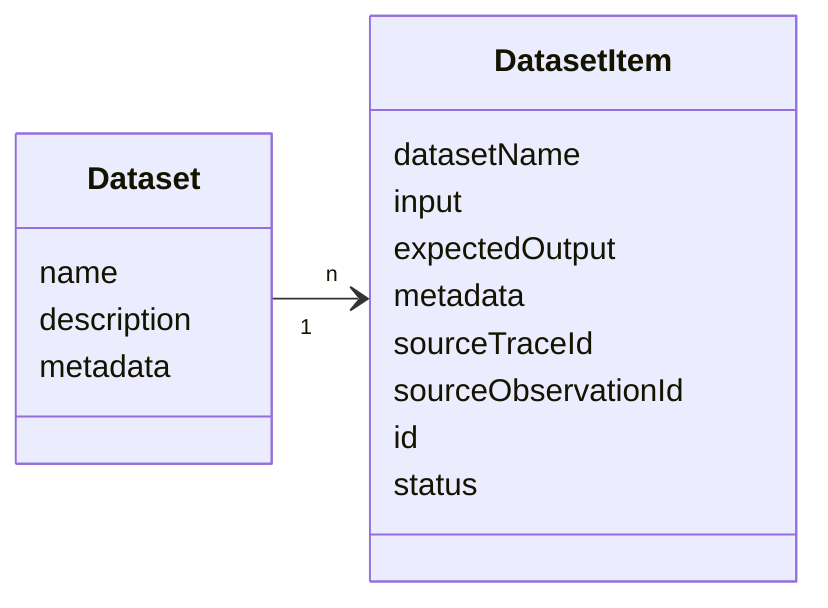
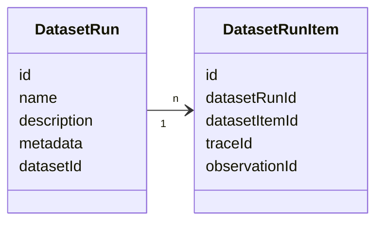
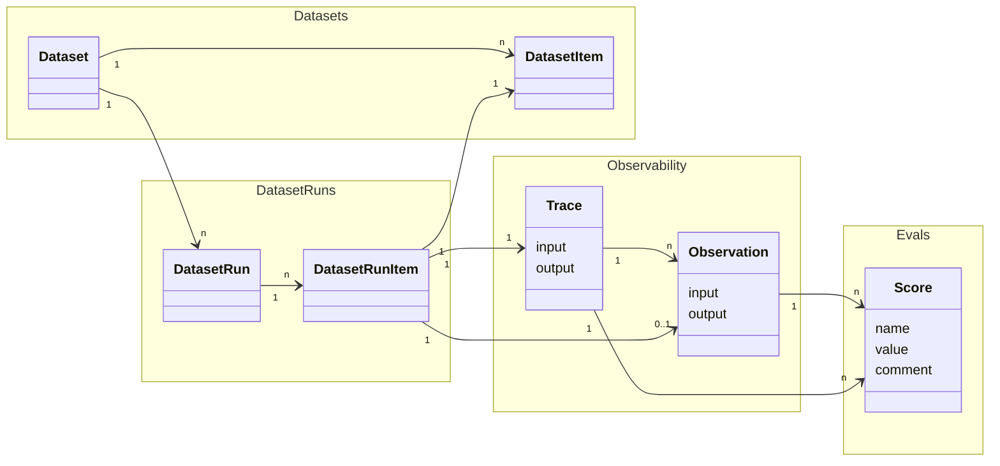

# Experiments Data Model

This page describes the data model for experiment-related objects in Langfuse. For an overview of how these objects work together, see the [Concepts](/docs/evaluation/core-concepts) page. For score and score config objects, see the [Scores data model](/docs/evaluation/scores/data-model).

For detailed reference please refer to
- the [Python SDK reference](https://python.reference.langfuse.com)
- the [JS/TS SDK reference](https://js.reference.langfuse.com)
- the [API reference](https://api.reference.langfuse.com)

## Objects

### Datasets [#datasets]

Datasets are a collection of inputs and, optionally, expected outputs that can be used during Dataset runs.

`Dataset`s are a collection of `DatasetItem`s.

<div className="border rounded p-2 my-4">



</div>

#### Dataset object [#dataset-object]

| Attribute                 | Type   | Required | Description                                                                 |
| ------------------------- | ------ | -------- | --------------------------------------------------------------------------- |
| `id`                      | string | Yes      | Unique identifier for the dataset                                           |
| `name`                    | string | Yes      | Name of the dataset                                                         |
| `description`             | string | No       | Description of the dataset                                                  |
| `metadata`                | object | No       | Additional metadata for the dataset                                         |
| `remoteExperimentUrl`     | string | No       | Webhook endpoint for triggering experiments                                 |
| `remoteExperimentPayload` | object | No       | Payload for triggering experiments                                 |

#### DatasetItem object [#datasetitem-object]

| Attribute               | Type           | Required | Description                                                                                                                                                                                               |
| ----------------------- | -------------- | -------- | --------------------------------------------------------------------------------------------------------------------------------------------------------------------------------------------------------- |
| `id`                    | string         | Yes      | Unique identifier for the dataset item. Dataset items are upserted on their id. Id needs to be unique (project-level) and cannot be reused across datasets.                                              |
| `datasetId`             | string         | Yes      | ID of the dataset this item belongs to                                                                                                                                                                    |
| `input`                 | object         | No       | Input data for the dataset item                                                                                                                                                                           |
| `expectedOutput`        | object         | No       | Expected output data for the dataset item                                                                                                                                                                 |
| `metadata`              | object         | No       | Additional metadata for the dataset item                                                                                                                                                                  |
| `sourceTraceId`         | string         | No       | ID of the source trace to link this dataset item to                                                                                                                                                       |
| `sourceObservationId`   | string         | No       | ID of the source observation to link this dataset item to                                                                                                                                                 |
| `status`                | DatasetStatus  | No       | Status of the dataset item. Defaults to ACTIVE for newly created items. Possible values: `ACTIVE`, `ARCHIVED`                                                                                            |

### DatasetRun (Experiment Run) [#datasetrun-experiment-run]

Dataset runs are used to run a dataset through your LLM application and optionally apply evaluation methods to the results. This is often referred to as Experiment run.

<br />
<div className="border rounded p-2">



</div>

#### DatasetRun object [#datasetrun-object]

| Attribute      | Type   | Required | Description                                                                 |
| -------------- | ------ | -------- | --------------------------------------------------------------------------- |
| `id`           | string | Yes      | Unique identifier for the dataset run                                       |
| `name`         | string | Yes      | Name of the dataset run                                                     |
| `description`  | string | No       | Description of the dataset run                                              |
| `metadata`     | object | No       | Additional metadata for the dataset run                                     |
| `datasetId`    | string | Yes      | ID of the dataset this run belongs to                                       |

#### DatasetRunItem object [#datasetrunitem-object]

| Attribute        | Type   | Required | Description                                                                                                                                                                                               |
| ---------------- | ------ | -------- | --------------------------------------------------------------------------------------------------------------------------------------------------------------------------------------------------------- |
| `id`             | string | Yes      | Unique identifier for the dataset run item                                                                                                                                                               |
| `datasetRunId`   | string | Yes      | ID of the dataset run this item belongs to                                                                                                                                                               |
| `datasetItemId`  | string | Yes      | ID of the dataset item to link to this run                                                                                                                                                               |
| `traceId`        | string | Yes      | ID of the trace to link to this run                                                                                                                                                                      |
| `observationId`  | string | No       | ID of the observation to link to this run                                                                                                                                                                |

Most of the time, we recommend that DatasetRunItems reference TraceIDs directly. The reference to ObservationID exists for backwards compatibility with older SDK versions.

### End to End Data Relations [#end-to-end-data-relations]

An experiment can combine a few Langfuse objects:
- `DatasetRuns` (or Experiment runs) are created by looping through all or selected `DatasetItem`s of a `Dataset` with your LLM application.
- For each `DatasetItem` passed into the LLM application as an Input a `DatasetRunItem` & a `Trace` are created.
- Optionally `Score`s can be added to the `Trace`s to evaluate the output of the LLM application during the `DatasetRun`.

<br />

<div className="border rounded p-2">



</div>

See the [Concepts page](/docs/evaluation/core-concepts) for more information on how these objects work together conceptually.
See the [observability core concepts page](/docs/observability/data-model) for more details on traces and observations.
See the [Scores data model](/docs/evaluation/scores/data-model) for more details on score and score config objects.

## Function Definitions [#function-definitions]

When running experiments via the SDK, you define **task** and **evaluator** functions. These are user-defined functions that the experiment runner calls for each dataset item. For more information on how experiments work conceptually, see the [Concepts page](/docs/evaluation/core-concepts).

### Task [#task]

A task is a function that takes a dataset item and returns an output during an experiment run.

See SDK references for function signatures and parameters:
- [Python SDK: `TaskFunction`](https://python.reference.langfuse.com/langfuse/experiment#TaskFunction)
- [JS/TS SDK: `ExperimentTask`](https://js.reference.langfuse.com/types/_langfuse_client.ExperimentTask.html)

### Evaluator [#evaluator]

An evaluator is a function that scores the output of a task for a single dataset item. Evaluators receive the input, output, expected output, and metadata, and return an `Evaluation` object that becomes a Score in Langfuse.

See SDK references for function signatures and parameters:
- [Python SDK: `EvaluatorFunction`](https://python.reference.langfuse.com/langfuse/experiment#EvaluatorFunction)
- [JS/TS SDK: `Evaluator`](https://js.reference.langfuse.com/types/_langfuse_client.Evaluator.html)

### Run Evaluator [#run-evaluator]

A run evaluator is a function that assesses the full experiment results and computes aggregate metrics. When run on Langfuse datasets, the resulting scores are attached to the dataset run.

See SDK references for function signatures and parameters:
- [Python SDK: `RunEvaluatorFunction`](https://python.reference.langfuse.com/langfuse/experiment#RunEvaluatorFunction)
- [JS/TS SDK: `RunEvaluator`](https://js.reference.langfuse.com/types/_langfuse_client.RunEvaluator.html)

For detailed usage examples of tasks and evaluators, see [Experiments via SDK](/docs/evaluation/experiments/experiments-via-sdk).

## Local Datasets [#local-datasets]

Currently, if an [Experiment via SDK](/docs/evaluation/experiments/experiments-via-sdk) is used to run experiments on local datasets, only traces are created in Langfuse - no dataset runs are generated. Each task execution creates an individual trace for observability and debugging.

We have improvements on our roadmap to support similar functionality such as run overviews, comparison views, and more for experiments on local datasets as for Langfuse datasets.

---
title: Datasets
description: Use Langfuse Datasets to create structured experiments to test and benchmark LLM applications.
sidebarTitle: Datasets
---

# Datasets

A dataset is a collection of inputs and expected outputs and is used to test your application. Both [UI-based](/docs/evaluation/experiments/experiments-via-ui) and [SDK-based](/docs/evaluation/experiments/experiments-via-sdk) experiments support Langfuse Datasets.

_Langfuse Dataset View_

<Frame fullWidth></Frame>

## Why use datasets?

- Create test cases for your application with real production traces
- Collaboratively create and collect dataset items with your team
- Have a single source of truth for your test data

## Get Started

<Steps>

### Creating a dataset

Datasets have a name which is unique within a project.

<LangTabs items={["Python SDK", "JS/TS SDK", "Langfuse UI"]}>
<Tab>

```python
langfuse.create_dataset(
    name="<dataset_name>",
    # optional description
    description="My first dataset",
    # optional metadata
    metadata={
        "author": "Alice",
        "date": "2022-01-01",
        "type": "benchmark"
    }
)
```

_See [Python SDK](/docs/sdk/python/sdk-v3) docs for details on how to initialize the Python client._

</Tab>
<Tab>

```ts
import { LangfuseClient } from "@langfuse/client"

const langfuse = new LangfuseClient()

await langfuse.api.datasets.create({
  name: "<dataset_name>",
  // optional description
  description: "My first dataset",
  // optional metadata
  metadata: {
    author: "Alice",
    date: "2022-01-01",
    type: "benchmark",
  },
});
```

</Tab>

<Tab>

1. **Navigate to** `Your Project` > `Datasets` 
2. **Click on** `+ New dataset` to create a new dataset.

<Frame fullWidth>

</Frame>

</Tab>

</LangTabs>

### Upload or create new dataset items

Dataset items can be added to a dataset by providing the input and optionally the expected output. If preferred, dataset items can be imported using the CSV uploader in the Langfuse UI.

<LangTabs items={["Python SDK", "JS/TS SDK", "Langfuse UI"]}>
<Tab>

```python
langfuse.create_dataset_item(
    dataset_name="<dataset_name>",
    # any python object or value, optional
    input={
        "text": "hello world"
    },
    # any python object or value, optional
    expected_output={
        "text": "hello world"
    },
    # metadata, optional
    metadata={
        "model": "llama3",
    }
)
```

_See [Python SDK](/docs/sdk/python/sdk-v3) docs for details on how to initialize the Python client._

</Tab>
<Tab>

```ts
import { LangfuseClient } from "@langfuse/client";

const langfuse = new LangfuseClient();

await langfuse.api.datasetItems.create({
  datasetName: "<dataset_name>",
  // any JS object or value
  input: {
    text: "hello world",
  },
  // any JS object or value, optional
  expectedOutput: {
    text: "hello world",
  },
  // metadata, optional
  metadata: {
    model: "llama3",
  },
});
```

_See [JS/TS SDK](/docs/sdk/typescript/guide) docs for details on how to initialize the JS/TS client._

</Tab>

<Tab>
<Tabs items={["Add item", "Import CSV", "Add from trace", "Add batch from observations table"]}>

<Tab>
  
  _Dataset uploads are meant to upload the input and expected output. If you already have generated outputs, please use the [Experiments SDK](/docs/evaluation/experiments/experiments-via-sdk)._

</Tab>

<Tab>
  Select multiple observations from the **Observations** table, then click **Actions** → **Add to dataset**. You can create a new dataset or add to an existing one, with flexible field mapping options to control how observation data maps to dataset items. See [Batch add observations to datasets](/docs/datasets#batch-add-observations-to-datasets) for details.
</Tab>

</Tabs>

</Tab>

</LangTabs>

</Steps>

## Dataset Folders

Datasets can be organized into virtual folders to group datasets serving similar use cases.
To create a folder, add slashes (`/`) to a dataset name. The UI shows every segment ending with a `/` as a folder automatically.

### Create and fetch a dataset in a folder

Use the Langfuse UI or SDK to create and fetch a dataset in a folder by adding a slash (`/`) to a dataset name.

<LangTabs items={["Python SDK", "JS/TS SDK", "Langfuse UI"]}>
<Tab>

```python
dataset_name = "evaluation/qa-dataset"

# When creating a dataset, use the full dataset name
langfuse.create_dataset(
    name=dataset_name,
)

# When fetching a dataset in a folder, use the full dataset name
langfuse.get_dataset(
    name=dataset_name
)

```

This creates and fetches a dataset named `qa-dataset` in a folder named `evaluation`. The full dataset name remains `evaluation/qa-dataset`.

</Tab>
<Tab>

```ts
import { LangfuseClient } from "@langfuse/client";

const langfuse = new LangfuseClient();

const datasetName = "evaluation/qa-dataset";
const encodedName = encodeURIComponent(datasetName); // "evaluation%2Fqa-dataset"

// When creating a dataset, use the full dataset name
await langfuse.dataset.create(datasetName);

// When fetching a dataset in a folder, use the encoded name
await langfuse.dataset.get(encodedName);
```

This creates and fetches a dataset named `qa-dataset` in a folder named `evaluation`. The full dataset name remains `evaluation/qa-dataset`.

</Tab>
<Tab>

In the UI, create a dataset and use a slash (`/`) in the name field to organize it into a folder. Fetch it by navigating to the folder, clicking on the folder name and clicking on the dataset name in the list.

</Tab>
</LangTabs>

  **URL Encoding**: When using dataset names with slashes as path parameters in
  the API or JS/TS SDK, use URL encoding. For example, in TypeScript: `encodeURIComponent(name)`.

## Versioning

To access Dataset Versions via the Langfuse UI, navigate to: **Datasets** > **Navigate to a specific dataset** > **Select Items Tab**. On this page you can toggle the version view.

Every `add`, `update`, `delete`, or `archive` of dataset items produces a new dataset version. Versions track changes over time using timestamps.

`GET` APIs return the latest version at query time by default. You can fetch datasets at specific version timestamps using the `version` parameter.

Versioning applies to dataset items only, not dataset schemas. Dataset schema changes do not create new versions.

### Fetch dataset at a specific version

You can retrieve a dataset as it existed at a specific point in time by providing a version timestamp. This returns only the items that existed at that timestamp.

<LangTabs items={["Python SDK", "JS/TS SDK", "Langfuse UI"]}>
<Tab>

```python
from langfuse import get_client
from datetime import datetime, timedelta

langfuse = get_client()

# Capture dataset state as of 2025-12-15 at 06:30:00 UTC
version_timestamp = datetime(2025, 12, 15, 6, 30, 0, tzinfo=timezone.utc)

# Fetch dataset at version timestamp
dataset_at_version = langfuse.get_dataset(
    name="my-dataset",
    version=version_timestamp
)

# Fetch latest version
dataset_latest = langfuse.get_dataset(name="my-dataset")
```

</Tab>
<Tab>

```typescript
import { LangfuseClient } from "@langfuse/client";

const langfuse = new LangfuseClient();

// Capture the timestamp (use item's createdAt)
const versionTimestamp = new Date("2025-12-15T06:30:00").toISOString();

// Fetch dataset at version timestamp
const datasetAtVersion = await langfuse.dataset.get("my-dataset", {
  version: versionTimestamp
});

// Fetch latest version
const datasetLatest = await langfuse.dataset.get("my-dataset");
```

</Tab>
<Tab>

You can view all dataset versions by navigating to **Datasets** → **Select a dataset** → **Items Tab** → Toggle the **Version view**.

<Frame fullWidth></Frame>

</Tab>
</LangTabs>

### Run experiments on versioned datasets

You can run experiments directly on versioned datasets. This is useful for comparing how your model performs against different dataset versions or reproducing experiment results with the exact dataset state from a specific point in time.

<LangTabs items={["Python SDK", "JS/TS SDK", "Langfuse UI"]}>
<Tab>

```python
from datetime import timedelta
import time
from langfuse import Langfuse

langfuse = Langfuse()

version_timestamp = datetime(2025, 12, 15, 6, 30, 0, tzinfo=timezone.utc)

# Fetch versioned dataset 
versioned_dataset = langfuse.get_dataset("qa-dataset", version=version_timestamp)

# Run experiment on the versioned dataset
def my_llm_application(*, item, **kwargs):
    # Your LLM application logic here
    # For this example, we'll just return the expected output
    return item.expected_output

result = versioned_dataset.run_experiment(
    name="Baseline Experiment v1",
    description="Running on dataset v1",
    task=my_llm_application
)
```

</Tab>
<Tab>

```typescript
import { LangfuseClient } from "@langfuse/client";

const langfuse = new LangfuseClient();

// Capture the version timestamp
const versionTimestamp = new Date("2025-12-15T06:30:00").toISOString();

// Fetch versioned dataset
const versionedDataset = await langfuse.dataset.get("qa-dataset", {
  version: versionTimestamp
});
// Run experiment on the versioned dataset
const result = await versionedDataset.runExperiment({
  name: "Baseline Experiment v1",
  description: "Running on dataset v1",
  task: async ({ item }) => {
    // Your LLM application logic here
    // For this example, we'll just return the expected output
    return item.expectedOutput;
  }
});
```

</Tab>
<Tab>

In the UI, you can select a specific dataset version when running experiments:

1. Navigate to **Experiments** → **Run Experiment**
2. Select your dataset in the **Dataset Selection** step
3. Choose a version from the **Dataset Version** dropdown
4. The dropdown shows available version timestamps
5. The experiment will run against the dataset state at that specific point in time
6. If no version is selected, the experiment runs against the latest version

<Frame fullWidth></Frame>

</Tab>
</LangTabs>

This approach ensures reproducibility by allowing you to:
- Re-run experiments on historical dataset versions even after items are updated or deleted
- Compare model performance before and after dataset changes
- Maintain experiment consistency and reproduce exact results from previous runs
- Test improvements against the same baseline dataset version

## Schema Enforcement

Optionally add JSON Schema validation to your datasets to ensure all dataset items conform to a defined structure. This helps maintain data quality, catch errors early, and ensure consistency across your team.

You can define JSON schemas for `input` and/or `expectedOutput` fields when creating or updating a dataset. Once set, all dataset items are automatically validated against these schemas. Valid items are accepted, invalid items are rejected with detailed error messages showing the validation issue.

<LangTabs items={["Python SDK", "JS/TS SDK", "Langfuse UI"]}>
<Tab>

```python
langfuse.create_dataset(
    name="qa-conversations",
    input_schema={
        "type": "object",
        "properties": {
            "messages": {
                "type": "array",
                "items": {
                    "type": "object",
                    "properties": {
                        "role": {"type": "string", "enum": ["user", "assistant", "system"]},
                        "content": {"type": "string"}
                    },
                    "required": ["role", "content"]
                }
            }
        },
        "required": ["messages"]
    },
    expected_output_schema={
        "type": "object",
        "properties": {"response": {"type": "string"}},
        "required": ["response"]
    }
)
```

</Tab>
<Tab>

```typescript
await langfuse.createDataset({
  name: "qa-conversations",
  inputSchema: {
    type: "object",
    properties: {
      messages: {
        type: "array",
        items: {
          type: "object",
          properties: {
            role: { type: "string", enum: ["user", "assistant", "system"] },
            content: { type: "string" }
          },
          required: ["role", "content"]
        }
      }
    },
    required: ["messages"]
  },
  expectedOutputSchema: {
    type: "object",
    properties: { response: { type: "string" } },
    required: ["response"]
  }
});
```

</Tab>
<Tab>

Navigate to **Datasets** → **New Dataset** or edit an existing dataset → Expand **Schema Validation** section → Add your JSON schemas → Click **Save**.

</Tab>
</LangTabs>

## Create synthetic datasets

Frequently, you want to create synthetic examples to test your application to bootstrap your dataset. LLMs are great at generating these by prompting for common questions/tasks.

To get started have a look at this cookbook for examples on how to generate synthetic datasets:

<Cards num={1}>
  }
  />
</Cards>

## Create items from production data

A common workflow is to select production traces where the application did not perform as expected. Then you let an expert add the expected output to test new versions of your application on the same data.

<LangTabs items={["Python SDK", "JS/TS SDK", "Langfuse UI"]}>
<Tab>

```python
langfuse.create_dataset_item(
    dataset_name="<dataset_name>",
    input={ "text": "hello world" },
    expected_output={ "text": "hello world" },
    # link to a trace
    source_trace_id="<trace_id>",
    # optional: link to a specific span, event, or generation
    source_observation_id="<observation_id>"
)
```

</Tab>
<Tab>

```ts
import { LangfuseClient } from "@langfuse/client";

const langfuse = new LangfuseClient();

await langfuse.api.datasetItems.create({
  datasetName: "<dataset_name>",
  input: { text: "hello world" },
  expectedOutput: { text: "hello world" },
  // link to a trace
  sourceTraceId: "<trace_id>",
  // optional: link to a specific span, event, or generation
  sourceObservationId: "<observation_id>",
});
```

</Tab>
<Tab>
In the UI, use `+ Add to dataset` on any observation (span, event, generation) of a production trace.

</Tab>
</LangTabs>

## Batch add observations to datasets

You can batch add multiple observations to a dataset directly from the observations table. This is useful for quickly building test datasets from production data.

The field mapping system gives you control over how observation data is transformed into dataset items. You can use the entire field as-is (e.g., map the full observation input to the dataset item input), extract specific values using JSON path expressions or build custom objects from multiple fields.

1. Navigate to the **Observations** table
2. Use filters to find relevant observations
3. Select observations using the checkboxes
4. Click **Actions** → **Add to dataset**
5. Choose to create a new dataset or select an existing one
6. Configure field mapping to control how observation data maps to dataset item fields
7. Preview the mapping and confirm

Batch operations run in the background with support for partial success. If some observations fail validation against a dataset schema, valid items are still added and errors are logged for review. You can monitor progress in **Settings** → **Batch Actions**.

## Edit/archive dataset items

You can edit or archive dataset items. Archiving items will remove them from future experiment runs.

<LangTabs items={["Python SDK", "JS/TS SDK", "Langfuse UI"]}>

<Tab>

You can upsert items by providing the `id` of the item you want to update.

```python
langfuse.create_dataset_item(
    id="<item_id>",
    # example: update status to "ARCHIVED"
    status="ARCHIVED"
)
```

</Tab>
<Tab>

You can upsert items by providing the `id` of the item you want to update.

```ts
import { LangfuseClient } from "@langfuse/client";

const langfuse = new LangfuseClient();

await langfuse.api.datasetItems.create({
  id: "<item_id>",
  // example: update status to "ARCHIVED"
  status: "ARCHIVED",
});
```

</Tab>
<Tab>
In the UI, you can edit the item by clicking on the item id. To archive or delete the item, click on the dots next to the item and select `Archive` or `Delete`.

<Frame fullWidth></Frame>

</Tab>
</LangTabs>

## Dataset runs

Once you created a dataset, you can test and evaluate your application based on it.

<Cards num={1}>

  }
    title="Experiments via SDK"
    href="/docs/evaluation/experiments/experiments-via-sdk"
    arrow
  />
  }
    title="Experiments via UI"
    href="/docs/evaluation/experiments/experiments-via-ui"
    arrow
  />
</Cards>

Learn more about the [Experiments data model](/docs/evaluation/experiments/data-model).


---
title: Experiments via SDK
description: Start experiments via the Langfuse SDK to programmatically test your application
---

# Experiments via SDK

Experiments via SDK are used to programmatically loop your applications or prompts through a dataset and optionally apply Evaluation Methods to the results. You can use a dataset hosted on Langfuse or a local dataset as the foundation for your experiment.

See also the [JS/TS SDK reference](https://js.reference.langfuse.com/classes/_langfuse_client.ExperimentManager.html) and the [Python SDK reference](https://python.reference.langfuse.com/langfuse#Langfuse.run_experiment) for more details on running experiments via the SDK.

## Why use Experiments via SDK?

- Full flexibility to use your own application logic
- Use custom scoring functions to evaluate the outputs of a single item and the full run
- Run multiple experiments on the same dataset in parallel
- Easy to integrate with your existing evaluation infrastructure

## Experiment runner SDK

Both the Python and JS/TS SDKs provide a high-level abstraction for running an experiment on a dataset. The dataset can be both local or hosted on Langfuse. Using the Experiment runner is the recommended way to run an experiment on a dataset with our SDK.

The experiment runner automatically handles:

- **Concurrent execution** of tasks with configurable limits
- **Automatic tracing** of all executions for observability
- **Flexible evaluation** with both item-level and run-level evaluators
- **Error isolation** so individual failures don't stop the experiment
- **Dataset integration** for easy comparison and tracking

The experiment runner SDK supports both datasets hosted on Langfuse and datasets hosted locally. If you are using a dataset hosted on Langfuse for your experiment, the SDK will automatically create a dataset run for you that you can inspect and compare in the Langfuse UI. For locally hosted datasets not on Langfuse, only traces and scores (if evaluations are used) are tracked in Langfuse.

### Basic Usage

Start with the simplest possible experiment to test your task function on local data. If you already have a dataset in Langfuse, [see here](#usage-with-langfuse-datasets).

<LangTabs items={["Python SDK", "JS/TS SDK"]}>
<Tab>

```python
from langfuse import get_client
from langfuse.openai import OpenAI

# Initialize client
langfuse = get_client()

# Define your task function
def my_task(*, item, **kwargs):
    question = item["input"]
    response = OpenAI().chat.completions.create(
        model="gpt-4.1", messages=[{"role": "user", "content": question}]
    )

    return response.choices[0].message.content


# Run experiment on local data
local_data = [
    {"input": "What is the capital of France?", "expected_output": "Paris"},
    {"input": "What is the capital of Germany?", "expected_output": "Berlin"},
]

result = langfuse.run_experiment(
    name="Geography Quiz",
    description="Testing basic functionality",
    data=local_data,
    task=my_task,
)

# Use format method to display results
print(result.format())
```

</Tab>
<Tab>

Make sure that OpenTelemetry is properly set up for traces to be delivered to Langfuse. See the [tracing setup documentation](/docs/observability/sdk/overview#initialize-tracing) for configuration details. Always flush the span processor at the end of execution to ensure all traces are sent.

```typescript
import { OpenAI } from "openai";
import { NodeSDK } from "@opentelemetry/sdk-node";

import {
  LangfuseClient,
  ExperimentTask,
  ExperimentItem,
} from "@langfuse/client";
import { observeOpenAI } from "@langfuse/openai";
import { LangfuseSpanProcessor } from "@langfuse/otel";

// Initialize OpenTelemetry
const otelSdk = new NodeSDK({ spanProcessors: [new LangfuseSpanProcessor()] });
otelSdk.start();

// Initialize client
const langfuse = new LangfuseClient();

// Run experiment on local data
const localData: ExperimentItem[] = [
  { input: "What is the capital of France?", expectedOutput: "Paris" },
  { input: "What is the capital of Germany?", expectedOutput: "Berlin" },
];

// Define your task function
const myTask: ExperimentTask = async (item) => {
  const question = item.input;

  const response = await observeOpenAI(new OpenAI()).chat.completions.create({
    model: "gpt-4.1",
    messages: [
      {
        role: "user",
        content: question,
      },
    ],
  });

  return response;
};

// Run the experiment
const result = await langfuse.experiment.run({
  name: "Geography Quiz",
  description: "Testing basic functionality",
  data: localData,
  task: myTask,
});

// Print formatted result
console.log(await result.format());

// Important: shut down OTEL SDK to deliver traces
await otelSdk.shutdown();
```

**Note for JS/TS SDK**: OpenTelemetry must be properly set up for traces to be delivered to Langfuse. See the [tracing setup documentation](/docs/observability/sdk/overview#initialize-tracing) for configuration details. Always flush the span processor at the end of execution to ensure all traces are sent.

</Tab>
</LangTabs>

When running experiments on local data, only traces are created in Langfuse - no dataset runs are generated. Each task execution creates an individual trace for observability and debugging.

### Usage with Langfuse Datasets

Run experiments directly on datasets stored in Langfuse for automatic tracing and comparison.

<LangTabs items={["Python SDK", "JS/TS SDK"]}>
<Tab>

```python
from langfuse import get_client
from langfuse.openai import OpenAI
 
# Initialize client
langfuse = get_client()
 
# Define your task function
def my_task(*, item, **kwargs):
    question = item.input # `run_experiment` passes a `DatasetItem` to the task function. The input of the dataset item is available as `item.input`.
    response = OpenAI().chat.completions.create(
        model="gpt-4.1", messages=[{"role": "user", "content": question}]
    )
 
    return response.choices[0].message.content

# Get dataset from Langfuse
dataset = langfuse.get_dataset("my-evaluation-dataset")

# Run experiment directly on the dataset
result = dataset.run_experiment(
    name="Production Model Test",
    description="Monthly evaluation of our production model",
    task=my_task # see above for the task definition
)

# Use format method to display results
print(result.format())
```

</Tab>

<Tab>

```typescript
// Get dataset from Langfuse
const dataset = await langfuse.dataset.get("my-evaluation-dataset");

// Run experiment directly on the dataset
const result = await dataset.runExperiment({
  name: "Production Model Test",
  description: "Monthly evaluation of our production model",
  task: myTask, // see above for the task definition
});

// Use format method to display results
console.log(await result.format());

// Important: shut down OpenTelemetry to ensure traces are sent to Langfuse
await otelSdk.shutdown();
```

</Tab>
</LangTabs>

When using Langfuse datasets, dataset runs are automatically created in Langfuse and are available for comparison in the UI. This enables tracking experiment performance over time and comparing different approaches on the same dataset.

Experiments always run on the latest dataset version at experiment time. Support for running experiments on specific dataset versions will be added to the SDK shortly.

### Advanced Features

Enhance your experiments with evaluators and advanced configuration options.

#### Evaluators

Evaluators assess the quality of task outputs at the item level. They receive the input, metadata, output, and expected output for each item and return evaluation metrics that are reported as scores on the traces in Langfuse.

<LangTabs items={["Python SDK", "JS/TS SDK"]}>
<Tab>

```python
from langfuse import Evaluation

# Define evaluation functions
def accuracy_evaluator(*, input, output, expected_output, metadata, **kwargs):
    if expected_output and expected_output.lower() in output.lower():
        return Evaluation(name="accuracy", value=1.0, comment="Correct answer found")

    return Evaluation(name="accuracy", value=0.0, comment="Incorrect answer")

def length_evaluator(*, input, output, **kwargs):
    return Evaluation(name="response_length", value=len(output), comment=f"Response has {len(output)} characters")

# Use multiple evaluators
result = langfuse.run_experiment(
    name="Multi-metric Evaluation",
    data=test_data,
    task=my_task,
    evaluators=[accuracy_evaluator, length_evaluator]
)

print(result.format())
```

</Tab>
<Tab>

```typescript
// Define evaluation functions
const accuracyEvaluator = async ({ input, output, expectedOutput }) => {
  if (
    expectedOutput &&
    output.toLowerCase().includes(expectedOutput.toLowerCase())
  ) {
    return {
      name: "accuracy",
      value: 1.0,
      comment: "Correct answer found",
    };
  }
  return {
    name: "accuracy",
    value: 0.0,
    comment: "Incorrect answer",
  };
};

const lengthEvaluator = async ({ input, output }) => {
  return {
    name: "response_length",
    value: output.length,
    comment: `Response has ${output.length} characters`,
  };
};

// Use multiple evaluators
const result = await langfuse.experiment.run({
  name: "Multi-metric Evaluation",
  data: testData,
  task: myTask,
  evaluators: [accuracyEvaluator, lengthEvaluator],
});

console.log(await result.format());
```

</Tab>
</LangTabs>

#### Run-level Evaluators

Run-level evaluators assess the full experiment results and compute aggregate metrics. When run on Langfuse datasets, these scores are attached to the full dataset run for tracking overall experiment performance.

<LangTabs items={["Python SDK", "JS/TS SDK"]}>
<Tab>

```python
from langfuse import Evaluation

def average_accuracy(*, item_results, **kwargs):
    """Calculate average accuracy across all items"""
    accuracies = [
        eval.value for result in item_results
        for eval in result.evaluations
        if eval.name == "accuracy"
    ]

    if not accuracies:
        return Evaluation(name="avg_accuracy", value=None)

    avg = sum(accuracies) / len(accuracies)

    return Evaluation(name="avg_accuracy", value=avg, comment=f"Average accuracy: {avg:.2%}")

result = langfuse.run_experiment(
    name="Comprehensive Analysis",
    data=test_data,
    task=my_task,
    evaluators=[accuracy_evaluator],
    run_evaluators=[average_accuracy]
)

print(result.format())
```

</Tab>
<Tab>

```typescript
const averageAccuracy = async ({ itemResults }) => {
  // Calculate average accuracy across all items
  const accuracies = itemResults
    .flatMap((result) => result.evaluations)
    .filter((evaluation) => evaluation.name === "accuracy")
    .map((evaluation) => evaluation.value as number);

  if (accuracies.length === 0) {
    return { name: "avg_accuracy", value: null };
  }

  const avg = accuracies.reduce((sum, val) => sum + val, 0) / accuracies.length;

  return {
    name: "avg_accuracy",
    value: avg,
    comment: `Average accuracy: ${(avg * 100).toFixed(1)}%`,
  };
};

const result = await langfuse.experiment.run({
  name: "Comprehensive Analysis",
  data: testData,
  task: myTask,
  evaluators: [accuracyEvaluator],
  runEvaluators: [averageAccuracy],
});

console.log(await result.format());
```

</Tab>
</LangTabs>

#### Async Tasks and Evaluators

Both task functions and evaluators can be asynchronous.

<LangTabs items={["Python SDK", "JS/TS SDK"]}>
<Tab>

```python
import asyncio
from langfuse.openai import AsyncOpenAI

async def async_llm_task(*, item, **kwargs):
    """Async task using OpenAI"""
    client = AsyncOpenAI()
    response = await client.chat.completions.create(
        model="gpt-4",
        messages=[{"role": "user", "content": item["input"]}]
    )

    return response.choices[0].message.content

# Works seamlessly with async functions
result = langfuse.run_experiment(
    name="Async Experiment",
    data=test_data,
    task=async_llm_task,
    max_concurrency=5  # Control concurrent API calls
)

print(result.format())
```

</Tab>
<Tab>

```typescript
import OpenAI from "openai";

const asyncLlmTask = async (item) => {
  // Async task using OpenAI
  const client = new OpenAI();
  const response = await client.chat.completions.create({
    model: "gpt-4",
    messages: [{ role: "user", content: item.input }],
  });

  return response.choices[0].message.content;
};

// Works seamlessly with async functions
const result = await langfuse.experiment.run({
  name: "Async Experiment",
  data: testData,
  task: asyncLlmTask,
  maxConcurrency: 5, // Control concurrent API calls
});

console.log(await result.format());
```

</Tab>
</LangTabs>

#### Configuration Options

Customize experiment behavior with various configuration options.

<LangTabs items={["Python SDK", "JS/TS SDK"]}>
<Tab>

```python
result = langfuse.run_experiment(
    name="Configurable Experiment",
    run_name="Custom Run Name", # will be dataset run name if dataset is used
    description="Experiment with custom configuration",
    data=test_data,
    task=my_task,
    evaluators=[accuracy_evaluator],
    run_evaluators=[average_accuracy],
    max_concurrency=10,  # Max concurrent executions
    metadata={  # Attached to all traces
        "model": "gpt-4",
        "temperature": 0.7,
        "version": "v1.2.0"
    }
)

print(result.format())
```

</Tab>
<Tab>

```typescript
const result = await langfuse.experiment.run({
  name: "Configurable Experiment",
  runName: "Custom Run Name", // will be dataset run name if dataset is used
  description: "Experiment with custom configuration",
  data: testData,
  task: myTask,
  evaluators: [accuracyEvaluator],
  runEvaluators: [averageAccuracy],
  maxConcurrency: 10, // Max concurrent executions
  metadata: {
    // Attached to all traces
    model: "gpt-4",
    temperature: 0.7,
    version: "v1.2.0",
  },
});

console.log(await result.format());
```

</Tab>
</LangTabs>

#### Testing in CI Environments

Integrate the experiment runner with testing frameworks like Pytest and Vitest to run automated evaluations in your CI pipeline. Use evaluators to create assertions that can fail tests based on evaluation results.

<LangTabs items={["Python SDK", "JS/TS SDK"]}>
<Tab>

```python
# test_geography_experiment.py
import pytest
from langfuse import get_client, Evaluation
from langfuse.openai import OpenAI

# Test data for European capitals
test_data = [
    {"input": "What is the capital of France?", "expected_output": "Paris"},
    {"input": "What is the capital of Germany?", "expected_output": "Berlin"},
    {"input": "What is the capital of Spain?", "expected_output": "Madrid"},
]

def geography_task(*, item, **kwargs):
    """Task function that answers geography questions"""
    question = item["input"]
    response = OpenAI().chat.completions.create(
        model="gpt-4",
        messages=[{"role": "user", "content": question}]
    )
    return response.choices[0].message.content

def accuracy_evaluator(*, input, output, expected_output, **kwargs):
    """Evaluator that checks if the expected answer is in the output"""
    if expected_output and expected_output.lower() in output.lower():
        return Evaluation(name="accuracy", value=1.0)

    return Evaluation(name="accuracy", value=0.0)

def average_accuracy_evaluator(*, item_results, **kwargs):
    """Run evaluator that calculates average accuracy across all items"""
    accuracies = [
        eval.value for result in item_results
        for eval in result.evaluations if eval.name == "accuracy"
    ]

    if not accuracies:
        return Evaluation(name="avg_accuracy", value=None)

    avg = sum(accuracies) / len(accuracies)

    return Evaluation(name="avg_accuracy", value=avg, comment=f"Average accuracy: {avg:.2%}")

@pytest.fixture
def langfuse_client():
    """Initialize Langfuse client for testing"""
    return get_client()

def test_geography_accuracy_passes(langfuse_client):
    """Test that passes when accuracy is above threshold"""
    result = langfuse_client.run_experiment(
        name="Geography Test - Should Pass",
        data=test_data,
        task=geography_task,
        evaluators=[accuracy_evaluator],
        run_evaluators=[average_accuracy_evaluator]
    )

    # Access the run evaluator result directly
    avg_accuracy = next(
        eval.value for eval in result.run_evaluations
        if eval.name == "avg_accuracy"
    )

    # Assert minimum accuracy threshold
    assert avg_accuracy >= 0.8, f"Average accuracy {avg_accuracy:.2f} below threshold 0.8"

def test_geography_accuracy_fails(langfuse_client):
    """Example test that demonstrates failure conditions"""
    # Use a weaker model or harder questions to demonstrate test failure
    def failing_task(*, item, **kwargs):
        # Simulate a task that gives wrong answers
        return "I don't know"

    result = langfuse_client.run_experiment(
        name="Geography Test - Should Fail",
        data=test_data,
        task=failing_task,
        evaluators=[accuracy_evaluator],
        run_evaluators=[average_accuracy_evaluator]
    )

    # Access the run evaluator result directly
    avg_accuracy = next(
        eval.value for eval in result.run_evaluations
        if eval.name == "avg_accuracy"
    )

    # This test will fail because the task gives wrong answers
    with pytest.raises(AssertionError):
        assert avg_accuracy >= 0.8, f"Expected test to fail with low accuracy: {avg_accuracy:.2f}"
```

</Tab>
<Tab>

```typescript
// test/geography-experiment.test.ts
import { describe, it, expect, beforeAll, afterAll } from "vitest";
import { OpenAI } from "openai";
import { NodeSDK } from "@opentelemetry/sdk-node";
import { LangfuseClient, ExperimentItem } from "@langfuse/client";
import { observeOpenAI } from "@langfuse/openai";
import { LangfuseSpanProcessor } from "@langfuse/otel";

// Test data for European capitals
const testData: ExperimentItem[] = [
  { input: "What is the capital of France?", expectedOutput: "Paris" },
  { input: "What is the capital of Germany?", expectedOutput: "Berlin" },
  { input: "What is the capital of Spain?", expectedOutput: "Madrid" },
];

let otelSdk: NodeSDK;
let langfuse: LangfuseClient;

beforeAll(async () => {
  // Initialize OpenTelemetry
  otelSdk = new NodeSDK({ spanProcessors: [new LangfuseSpanProcessor()] });
  otelSdk.start();

  // Initialize Langfuse client
  langfuse = new LangfuseClient();
});

afterAll(async () => {
  // Clean shutdown
  await otelSdk.shutdown();
});

const geographyTask = async (item: ExperimentItem) => {
  const question = item.input;
  const response = await observeOpenAI(new OpenAI()).chat.completions.create({
    model: "gpt-4",
    messages: [{ role: "user", content: question }],
  });

  return response.choices[0].message.content;
};

const accuracyEvaluator = async ({ input, output, expectedOutput }) => {
  if (
    expectedOutput &&
    output.toLowerCase().includes(expectedOutput.toLowerCase())
  ) {
    return { name: "accuracy", value: 1 };
  }
  return { name: "accuracy", value: 0 };
};

const averageAccuracyEvaluator = async ({ itemResults }) => {
  // Calculate average accuracy across all items
  const accuracies = itemResults
    .flatMap((result) => result.evaluations)
    .filter((evaluation) => evaluation.name === "accuracy")
    .map((evaluation) => evaluation.value as number);

  if (accuracies.length === 0) {
    return { name: "avg_accuracy", value: null };
  }

  const avg = accuracies.reduce((sum, val) => sum + val, 0) / accuracies.length;
  return {
    name: "avg_accuracy",
    value: avg,
    comment: `Average accuracy: ${(avg * 100).toFixed(1)}%`,
  };
};

describe("Geography Experiment Tests", () => {
  it("should pass when accuracy is above threshold", async () => {
    const result = await langfuse.experiment.run({
      name: "Geography Test - Should Pass",
      data: testData,
      task: geographyTask,
      evaluators: [accuracyEvaluator],
      runEvaluators: [averageAccuracyEvaluator],
    });

    // Access the run evaluator result directly
    const avgAccuracy = result.runEvaluations.find(
      (eval) => eval.name === "avg_accuracy"
    )?.value as number;

    // Assert minimum accuracy threshold
    expect(avgAccuracy).toBeGreaterThanOrEqual(0.8);
  }, 30_000); // 30 second timeout for API calls

  it("should fail when accuracy is below threshold", async () => {
    // Task that gives wrong answers to demonstrate test failure
    const failingTask = async (item: ExperimentItem) => {
      return "I don't know";
    };

    const result = await langfuse.experiment.run({
      name: "Geography Test - Should Fail",
      data: testData,
      task: failingTask,
      evaluators: [accuracyEvaluator],
      runEvaluators: [averageAccuracyEvaluator],
    });

    // Access the run evaluator result directly
    const avgAccuracy = result.runEvaluations.find(
      (eval) => eval.name === "avg_accuracy"
    )?.value as number;

    // This test will fail because the task gives wrong answers
    expect(() => {
      expect(avgAccuracy).toBeGreaterThanOrEqual(0.8);
    }).toThrow();
  }, 30_000);
});
```

</Tab>
</LangTabs>

These examples show how to use the experiment runner's evaluation results to create meaningful test assertions in your CI pipeline. Tests can fail when accuracy drops below acceptable thresholds, ensuring model quality standards are maintained automatically.

### Autoevals Integration

Access pre-built evaluation functions through the [autoevals library](https://github.com/braintrustdata/autoevals) integration.

<LangTabs items={["Python SDK", "JS/TS SDK"]}>
<Tab>

The Python SDK supports AutoEvals evaluators through direct integration:

```python
from langfuse.experiment import create_evaluator_from_autoevals
from autoevals.llm import Factuality

evaluator = create_evaluator_from_autoevals(Factuality())

result = langfuse.run_experiment(
    name="Autoevals Integration Test",
    data=test_data,
    task=my_task,
    evaluators=[evaluator]
)

print(result.format())
```

</Tab>
<Tab>

The JS SDK provides seamless integration with the AutoEvals library for pre-built evaluation functions:

```typescript
import { Factuality, Levenshtein } from "autoevals";
import { createEvaluatorFromAutoevals } from "@langfuse/client";

// Convert AutoEvals evaluators to Langfuse-compatible format
const factualityEvaluator = createEvaluatorFromAutoevals(Factuality());
const levenshteinEvaluator = createEvaluatorFromAutoevals(Levenshtein());

// Use with additional parameters
const customFactualityEvaluator = createEvaluatorFromAutoevals(
  Factuality,
  { model: "gpt-4o" } // Additional AutoEvals parameters
);

const result = await langfuse.experiment.run({
  name: "AutoEvals Integration Test",
  data: testDataset,
  task: myTask,
  evaluators: [
    factualityEvaluator,
    levenshteinEvaluator,
    customFactualityEvaluator,
  ],
});

console.log(await result.format());
```

</Tab>
</LangTabs>

## Low-level SDK methods

If you need more control over the dataset run, you can use the low-level SDK methods in order to loop through the dataset items and execute your application logic.

<Steps>

### Load the dataset

Use the Python or JS/TS SDK to load the dataset.

<LangTabs items={["Python SDK", "JS/TS SDK"]}>
<Tab>

```python
from langfuse import get_client

dataset = get_client().get_dataset("<dataset_name>")
```

</Tab>
<Tab>

```ts
import { LangfuseClient } from "@langfuse/client";

const langfuse = new LangfuseClient();

const dataset = await langfuse.dataset.get("<dataset_name>");
```

</Tab>
</LangTabs>

### Instrument your application

First we create our application runner helper function. This function will be called for every dataset item in the next step. If you use Langfuse for production observability, you do not need to change your application code.

  For a dataset run, it is important that your application creates Langfuse
  traces for each execution so they can be linked to the dataset item. Please
  refer to the [integrations](/docs/integrations/overview) page for details on
  how to instrument the framework you are using.

<LangTabs items={["Python SDK", "JS/TS SDK", "Langchain (Python)", "Langchain (JS/TS)", "Vercel AI SDK", "Other frameworks"]}>
<Tab>

Assume you already have a Langfuse-instrumented LLM-app:

```python filename="app.py"
from langfuse import get_client, observe
from langfuse.openai import OpenAI

@observe
def my_llm_function(question: str):
    response = OpenAI().chat.completions.create(
        model="gpt-4o", messages=[{"role": "user", "content": question}]
    )
    output = response.choices[0].message.content

    # Update observation input / output
    get_client().update_current_observation(input=question, output=output)

    return output
```

_See [Python SDK](/docs/sdk/python/sdk-v3) docs for more details._

</Tab>

<Tab>

Please make sure you have [the Langfuse SDK](/docs/observability/sdk/overview#initialize-tracing) set up for tracing of your application. If you use Langfuse for [observability](/docs/observability/overview), this is the same setup.

Example:

```ts filename="app.ts"
import { OpenAI } from "openai"

import { LangfuseClient } from "@langfuse/client";
import { startActiveObservation } from "@langfuse/tracing";
import { observeOpenAI } from "@langfuse/openai";

const myLLMApplication = async (input: string) => {
  return startActiveObservation("my-llm-application", async (span) => {
    const output = await observeOpenAI(new OpenAI()).chat.completions.create({
      model: "gpt-4o",
      messages: [{ role: "user", content: input }],
    });

    span.update({ input, output: output.choices[0].message.content });

    // return reference to span and output
    // will be simplified in a future version of the SDK
    return [span, output] as const;
  }
};
```

</Tab>
<Tab>

```python filename="app.py" /config={"callbacks": [langfuse_handler]}/
from langchain_openai import ChatOpenAI
from langchain_core.prompts import ChatPromptTemplate

def my_langchain_chain(question, langfuse_handler):
  llm = ChatOpenAI(model_name="gpt-4o")
  prompt = ChatPromptTemplate.from_template("Answer the question: {question}")
  chain = prompt | llm

  response = chain.invoke(
      {"question": question},
      config={"callbacks": [langfuse_handler]})

  return response
```

</Tab>

<Tab>

```ts filename="app.ts" /callbacks: [langfuseHandler]/
import { CallbackHandler } from "@langfuse/langchain";

const myLLMApplication = async (input: string) => {
  return startActiveObservation('my_llm_application', async (span) => {
    // ... your Langchain code ...
    const langfuseHandler = new CallbackHandler();
    const output = await chain.invoke({ input }, { callbacks: [langfuseHandler] });

    span.update({ input, output });

    // return reference to span and output
    // will be simplified in a future version of the SDK
    return [span, output] as const;
  }
}
```

</Tab>

<Tab>

Please refer to the [Vercel AI SDK](/integrations/frameworks/vercel-ai-sdk) docs for details on how to use the Vercel AI SDK with Langfuse.

```ts filename="app.ts"
const runMyLLMApplication = async (input: string, traceId: string) => {
  return startActiveObservation("my_llm_application", async (span) => {
    const output = await generateText({
      model: openai("gpt-4o"),
      maxTokens: 50,
      prompt: input,
      experimental_telemetry: {
        isEnabled: true,
        functionId: "vercel-ai-sdk-example-trace",
      },
    });

    span.update({ input, output: output.text });

    // return reference to span and output
    // will be simplified in a future version of the SDK
    return [span, output] as const;
  }
};
```

</Tab>

<Tab>

Please refer to the [integrations](/docs/integrations/overview) page for details on how to instrument the framework you are using.

<Cards num={2}>
  <Card
    icon={
      <div className="w-6 h-6 dark:bg-white rounded-sm p-0.5 flex items-center justify-center">
        
      </div>
    }
    title="Vercel AI SDK"
    href="/integrations/frameworks/vercel-ai-sdk"
    arrow
  />
  <Card
    icon={
      <div className="w-6 h-6 dark:bg-white rounded-sm p-0.5 flex items-center justify-center">
        
      </div>
    }
    title="Llamaindex"
    href="/integrations/frameworks/llamaindex"
    arrow
  />
  <Card
    icon={
      <div className="w-6 h-6 dark:bg-white rounded-sm p-0.5 flex items-center justify-center">
        
      </div>
    }
    title="CrewAI"
    href="/integrations/frameworks/crewai"
    arrow
  />
  <Card
    icon={
      <div className="w-6 h-6 dark:bg-white rounded-sm p-0.5 flex items-center justify-center">
        
      </div>
    }
    title="Ollama"
    href="/integrations/model-providers/ollama"
    arrow
  />
  <Card
    icon={
      <div className="w-6 h-6 dark:bg-white rounded-sm p-0.5 flex items-center justify-center">
        
      </div>
    }
    title="LiteLLM"
    href="/integrations/gateways/litellm"
    arrow
  />
  <Card
    icon={
      <div className="w-6 h-6 dark:bg-white rounded-sm p-0.5 flex items-center justify-center">
        
      </div>
    }
    title="AutoGen"
    href="/integrations/frameworks/autogen"
    arrow
  />
  <Card
    icon={
      <div className="w-6 h-6 dark:bg-white rounded-sm p-0.5 flex items-center justify-center">
        
      </div>
    }
    title="Google ADK"
    href="/integrations/frameworks/google-adk"
    arrow
  />
  
</Cards>

</Tab>

</LangTabs>

### Run experiment on dataset

When running an experiment on a dataset, the application that shall be tested is executed for each item in the dataset. The execution trace is then linked to the dataset item. This allows you to compare different runs of the same application on the same dataset.

Each experiment is identified by a unique `run_name`. If you reuse the same `run_name`, the new run will not appear separately in the Langfuse dataset run UI. As a good practice, include a timestamp in your `run_name` to ensure uniqueness (the [Experiment Runner SDK](#experiment-runner-sdk) does this automatically).

<LangTabs items={["Python SDK", "JS/TS SDK", "Langchain (Python)", "Langchain (JS/TS)", "Vercel AI SDK", "Other frameworks"]}>
<Tab>

You may then execute that LLM-app for each dataset item to create a dataset run:

In Python SDK v4, `item.run()` has been removed. Use `dataset.run_experiment()` instead, which handles attribute propagation automatically. See [Python v3 → v4 migration](/docs/observability/sdk/upgrade-path/python-v3-to-v4).

```python filename="execute_dataset.py" /for item in dataset.items:/
from datetime import datetime
from langfuse import get_client
from .app import my_llm_application

# Load the dataset
dataset = get_client().get_dataset("<dataset_name>")

# Include a timestamp to ensure the run_name is unique
run_name = f"my-experiment-{datetime.now().isoformat()}"

# Loop over the dataset items
for item in dataset.items:
    # Use the item.run() context manager for automatic trace linking
    with item.run(
        run_name=run_name,
        run_description="My first run",
        run_metadata={"model": "llama3"},
    ) as root_span:
        # Execute your LLM-app against the dataset item input
        output = my_llm_application.run(item.input)

        # Optionally: Add scores computed in your experiment runner, e.g. json equality check
        root_span.score_trace(
            name="<example_eval>",
            value=my_eval_fn(item.input, output, item.expected_output),
            comment="This is a comment",  # optional, useful to add reasoning
        )

# Flush the langfuse client to ensure all data is sent to the server at the end of the experiment run
get_client().flush()
```

_See [Python SDK](/docs/sdk/python/sdk-v3) docs for details on the new OpenTelemetry-based SDK._

</Tab>

<Tab>

```ts /for (const item of dataset.items)/
import { LangfuseClient } from "@langfuse/client";

const langfuse = new LangfuseClient();

// Include a timestamp to ensure the run_name is unique
const runName = `my-experiment-${new Date().toISOString()}`;

for (const item of dataset.items) {
  // execute application function and get langfuseObject (trace/span/generation/event, and other observation types: see /docs/observability/features/observation-types)
  // output also returned as it is used to evaluate the run
  // you can also link using ids, see sdk reference for details
  const [span, output] = await myLlmApplication.run(item.input);

  // link the execution trace to the dataset item and give it a run_name
  await item.link(span, runName, {
    description: "My first run", // optional run description
    metadata: { model: "llama3" }, // optional run metadata
  });

  // Optionally: Add scores
  langfuse.score.trace(span, {
    name: "<score_name>",
    value: myEvalFunction(item.input, output, item.expectedOutput),
    comment: "This is a comment", // optional, useful to add reasoning
  });
}

// Flush the langfuse client to ensure all score data is sent to the server at the end of the experiment run
await langfuse.flush();
```

</Tab>
<Tab>

In Python SDK v4, `item.run()` has been removed. Use `dataset.run_experiment()` instead, which handles attribute propagation automatically. See [Python v3 → v4 migration](/docs/observability/sdk/upgrade-path/python-v3-to-v4).

```python /for item in dataset.items:/
from datetime import datetime
from langfuse import get_client
from langfuse.langchain import CallbackHandler
#from .app import my_llm_application

# Load the dataset
dataset = get_client().get_dataset("<dataset_name>")

# Include a timestamp to ensure the run_name is unique
run_name = f"my-experiment-{datetime.now().isoformat()}"

# Initialize the Langfuse handler
langfuse_handler = CallbackHandler()

# Loop over the dataset items
for item in dataset.items:
    # Use the item.run() context manager for automatic trace linking
    with item.run(
        run_name=run_name,
        run_description="My first run",
        run_metadata={"model": "llama3"},
    ) as root_span:
        # Execute your LLM-app against the dataset item input
        output = my_langchain_chain(item.input, langfuse_handler)

        # Update top-level trace input and output (deprecated — only for backward compat with legacy trace-level LLM-as-a-judge evaluators)
        root_span.set_trace_io(input=item.input, output=output.content)

        # Optionally: Add scores computed in your experiment runner, e.g. json equality check
        root_span.score_trace(
            name="<example_eval>",
            value=my_eval_fn(item.input, output, item.expected_output),
            comment="This is a comment",  # optional, useful to add reasoning
        )

# Flush the langfuse client to ensure all data is sent to the server at the end of the experiment run
get_client().flush()
```

</Tab>

<Tab>

```typescript /item.link/ /langfuseHandler/ /for (const item of dataset.items)/
import { LangfuseClient } from "@langfuse/client";
import { CallbackHandler } from "@langfuse/langchain";
...

const langfuse = new LangfuseClient()
// Include a timestamp to ensure the run_name is unique
const runName = `my-dataset-run-${new Date().toISOString()}`;
for (const item of dataset.items) {
  const [span, output] = await startActiveObservation('my_llm_application', async (span) => {
    // ... your Langchain code ...
    const langfuseHandler = new CallbackHandler();
    const output = await chain.invoke({ input: item.input }, { callbacks: [langfuseHandler] });

    span.update({ input: item.input, output });

    return [span, output] as const;
  });

  await item.link(span, runName)

  // Optionally: Add scores
  langfuse.score.trace(span, {
    name: "test-score",
    value: 0.5,
  });
}

await langfuse.flush();
```

</Tab>
<Tab>

```typescript /for (const item of dataset.items)/
import { LangfuseClient } from "@langfuse/client";

const langfuse = new LangfuseClient();

// Include a timestamp to ensure the run_name is unique
const runName = `my-experiment-${new Date().toISOString()}`;

// iterate over the dataset items
for (const item of dataset.items) {
  // run application on the dataset item input
  const [span, output] = await runMyLLMApplication(item.input, trace.id);

  // link the execution trace to the dataset item and give it a run_name
  await item.link(span, runName, {
    description: "My first run", // optional run description
    metadata: { model: "gpt-4o" }, // optional run metadata
  });

  // Optionally: Add scores
  langfuse.score.trace(span, {
    name: "<score_name>",
    value: myEvalFunction(item.input, output, item.expectedOutput),
    comment: "This is a comment", // optional, useful to add reasoning
  });
}

// Flush the langfuse client to ensure all score data is sent to the server at the end of the experiment run
await langfuse.flush();
```

</Tab>
<Tab>

Please refer to the [integrations](/docs/integrations/overview) page for details on how to instrument the framework you are using.

</Tab>
</LangTabs>

If you want to learn more about how adding evaluation scores from the code works, please refer to the docs:

<Cards num={1}>

  }
    title="Add custom scores"
    href="/docs/evaluation/evaluation-methods/custom-scores"
    arrow
  />
</Cards>

### Optionally: Run Evals in Langfuse

In the code above, we show how to add scores to the dataset run from your experiment code.

Alternatively, you can run evals in Langfuse. This is useful if you want to use the [LLM-as-a-judge](/docs/evaluation/evaluation-methods/llm-as-a-judge) feature to evaluate the outputs of the dataset runs. We have recorded a [10 min walkthrough](/guides/videos/llm-as-a-judge-eval-on-dataset-experiments) on how this works end-to-end.

<Cards num={1}>

  }
    title="Set up LLM-as-a-judge"
    href="/docs/evaluation/evaluation-methods/llm-as-a-judge"
    arrow
  />
</Cards>

### Compare dataset runs

After each experiment run on a dataset, you can check the aggregated score in the dataset runs table and compare results side-by-side.

</Steps>

## Optional: Trigger SDK Experiment from UI

When setting up Experiments via SDK, it can be useful to allow triggering the experiment runs from the Langfuse UI.

You need to set up a webhook to receive the trigger request from Langfuse.

<Steps>

### Navigate to the dataset

- **Navigate to** `Your Project` > `Datasets`
- **Click on** the dataset you want to set up a remote experiment trigger for

<Frame className="max-w-lg"></Frame>

### Open the setup page

**Click on** `Start Experiment` to open the setup page

<Frame className="max-w-lg"></Frame>

**Click on** `⚡` below `Custom Experiment`

<Frame className="max-w-lg">
  
</Frame>

### Configure the webhook [#configure-webhook]

**Enter** the URL of your external evaluation service that will receive the webhook when experiments are triggered.
**Specify** a default config that will be sent to your webhook. Users can modify this when triggering experiments.

<Frame className="max-w-lg">
  
</Frame>

### Trigger experiments

Once configured, team members can trigger remote experiments via the `Run` button under the **Custom Experiment** option. Langfuse will send the dataset metadata (ID and name) along with any custom configuration to your webhook.

<Frame className="max-w-lg">
  
</Frame>

</Steps>

**Typical workflow**: Your webhook receives the request, fetches the dataset from Langfuse, runs your application against the dataset items, evaluates the results, and ingests the scores back into Langfuse as a new Experiment run.


---
title: Experiments via UI
description: Experiment with different prompt versions and models on a dataset and compare the results side-by-side directly from the Langfuse UI.
---

# Experiments via UI (Prompt Experiments)

You can execute Experiments via UI (also called Prompt Experiments) in the Langfuse UI to test different prompt versions from [Prompt Management](/docs/prompt-management) or language models and compare the results side-by-side.

Optionally, you can use [LLM-as-a-Judge Evaluators](/docs/evaluation/evaluation-methods/llm-as-a-judge) to automatically score the responses based on the expected outputs to further analyze the results on an aggregate level.

## Why use Prompt Experiments?

- Quickly test different prompt versions or models
- Structure your prompt testing by using a dataset to test different prompt versions and models
- Quickly iterate on prompts through Prompt Experiments
- Optionally use LLM-as-a-Judge Evaluators to score the responses based on the expected outputs from the dataset
- Prevent regressions by running tests when making prompt changes

Experiments always run on the latest dataset version at experiment time. Support for running experiments on specific dataset versions will be added shortly.

## Prerequisites

<Steps>

### Create a usable prompt

Create a prompt that you want to test and evaluate. [How to create a prompt?](/docs/prompt-management/get-started)

  **A prompt is usable when:** your prompt has variables that match the dataset
  item keys in the dataset that will be used for the Experiment. See the
  example below.

<details>
<summary>Example: Prompt Variables & Dataset Item Keys Mapping</summary>
<div className="grid md:grid-cols-1 gap-4">
<div>

<br />
**Prompt:**

```bash You are a Langfuse expert. Answer based on:
{{ documentation }}

Question: {{question}}

```

</div>
<div>

<br />
**Dataset Item:**

```json
{
  "documentation": "Langfuse is an LLM Engineering Platform",
  "question": "What is Langfuse?"
}
```

</div>
</div>

In this example:

- The prompt variable `{{documentation}}` maps to the JSON key `"documentation"`
- The prompt variable `{{question}}` maps to the JSON key `"question"`
- Both keys must exist in the dataset item's input JSON for the experiment to run successfully

</details>

<details>
<summary>Example: Chat Message Placeholder Mapping</summary>

In addition to variables, you can also map placeholders in chat message prompts to dataset item keys.
This is useful when the dataset item also contains for example a chat message history to use.
Your chat prompt needs to contain a placeholder with a name. Variables within placeholders are not resolved.

**Chat Prompt:**
Placeholder named: `message_history`

**Dataset Item:**

```json
{
  "message_history": [
    {
      "role": "user",
      "content": "What is Langfuse?"
    },
    {
      "role": "assistant",
      "content": "Langfuse is a tool for tracking and analyzing the performance of language models."
    }
  ],
  "question": "What is Langfuse?"
}
```

In this example:

- The chat prompt placeholder `message_history` maps to the JSON key `"message_history"`.
- The prompt variable `{{question}}` maps to the JSON key `"question"` in a variable not within a placeholder message.
- Both keys must exist in the dataset item's input JSON for the experiment to run successfully

</details>

### Create a usable dataset

Create a dataset with the inputs and expected outputs you want to use for your prompt experiments. [How to create a dataset?](/docs/evaluation/dataset-runs/datasets)

  **A dataset is usable when:** [1] the dataset items have JSON objects as input
  and [2] these objects have JSON keys that match the prompt variables of the
  prompt(s) you will use. See the example below.

 <details>
<summary>Example: Prompt Variables & Dataset Item Keys Mapping</summary>
<div className="grid md:grid-cols-1 gap-4">
<div>

<br />
**Prompt:**

```bash You are a Langfuse expert. Answer based on:
{{ documentation }}

Question: {{question}}

```

</div>
<div>

<br />
**Dataset Item:**

```json
{
  "documentation": "Langfuse is an LLM Engineering Platform",
  "question": "What is Langfuse?"
}
```

</div>
</div>

In this example:

- The prompt variable `{{documentation}}` maps to the JSON key `"documentation"`
- The prompt variable `{{question}}` maps to the JSON key `"question"`
- Both keys must exist in the dataset item's input JSON for the experiment to run successfully

</details>

### Configure LLM connection

As your prompt will be executed for each dataset item, you need to configure an LLM connection in the project settings. [How to configure an LLM connection?](/docs/administration/llm-connection)

### Optional: Set up LLM-as-a-judge

You can set up an LLM-as-a-judge evaluator to score the responses based on the expected outputs. Make sure to set the target of the LLM-as-a-Judge to "Experiment runs" and filter for the dataset you want to use. [How to set up LLM-as-a-judge?](/docs/evaluation/evaluation-methods/llm-as-a-judge)

</Steps>

## Trigger an Experiment via UI (Prompt Experiment)

<Steps>
### Navigate to the dataset
Experiments are currently started from the detail page of a dataset.

- **Navigate to** `Your Project` > `Datasets`
- **Click on** the dataset you want to start an Experiment for

<Frame fullWidth>
  
</Frame>

### Open the setup page

**Click on** `Start Experiment` to open the setup page

<Frame fullWidth>
  
</Frame>

**Click on** `Create` below `prompt Experiment`

<Frame></Frame>

### Configure the Experiment

1. **Set** an Experiment name
2. **Select** the prompt you want to use
   - If you only have one piece of dynamic content, we recommend a chat prompt with a static system prompt and a dynamic user message (e.g., full user message as a variable). This ensures you can map your dynamic content as the user message. 
   - If you have multiple pieces of dynamic content, we recommend creating a variable in the prompt for each piece of dynamic content. This ensures you can map your dynamic content to the corresponding variable.
3. **Set up or select** the LLM connection you want to use
4. **Select** the dataset you want to use
5. **Optionally configure structured output** - Toggle on to enforce a JSON schema response format
   - Select an existing schema from your project or create a new one
   - Schemas can be created and saved in the [Playground](/docs/playground) and reused here
   - View/edit schemas using the eye icon next to the schema selector
6. **Optionally select** the evaluator you want to use
7. **Click on** `Create` to trigger the Experiment

<Frame></Frame>

  **Structured output** ensures that LLM responses conform to a specific JSON
  schema. This is useful when you need consistent, parseable outputs for
  evaluation or downstream processing. The same schemas you define in the
  Playground are available for use in experiments.

This will trigger the Experiment and you will be redirected to the Experiments page. The run might take a few seconds or minutes to complete depending on the prompt complexity and dataset size.

### Compare runs

After each Experiment run, you can check the aggregated score in the Experiments table and compare results side-by-side. See our guide on [Systematic Evaluation of AI Agents](/blog/2025-11-06-experiment-interpretation) for details on regression analysis and multi-candidate comparison.

</Steps>

## Related Resources

- If you need to evaluate full application or agent logic (including custom runtime configuration) instead of prompt-only runs, use [Experiments via SDK](/docs/evaluation/experiments/experiments-via-sdk). You can also trigger an SDK-based evaluation run via the UI with [webhooks](/docs/evaluation/experiments/experiments-via-sdk#configure-webhook).

## GitHub Discussions

