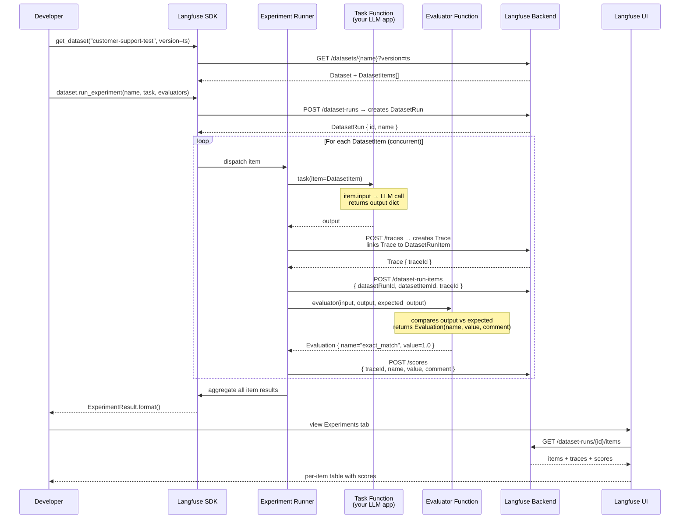
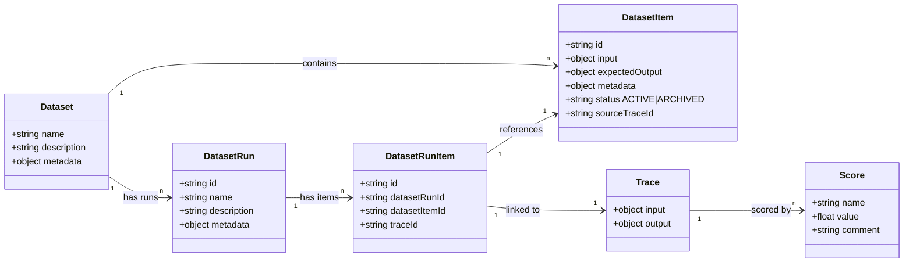

# Langfuse Experiments Lab — Architecture Diagrams

---

## Diagram 1: Lab Overview — What's Happening in This Lab

```mermaid
flowchart TD
    subgraph ENV["🐳 Environment Setup"]
        DC[Docker Compose\nLangfuse + Postgres + Redis]
        PY[Python venv\nlangfuse · openai · python-dotenv]
        ENV_FILE[.env\nPUBLIC_KEY · SECRET_KEY · HOST]
    end

    subgraph DATA["📦 Chapter 1–3: Build the Dataset"]
        DS[Create Dataset\ncustomer-support-test]
        ITEMS[Add Dataset Items\ninput + expected_output + metadata]
        FOLDERS[Organize with Folders\nevaluation/qa/customer_support\nproduction/monitored_queries]
        DS --> ITEMS --> FOLDERS
    end

    subgraph TASK["⚙️ Chapter 4: Define Task Function"]
        TF["task.py\nmy_support_bot(*, item, **kwargs)\n→ returns dict with response"]
        TEST[test-task.py\nManually verify output vs expected]
        TF --> TEST
    end

    subgraph EXPERIMENT["🧪 Chapter 5: Run Experiment"]
        EXP[run_experiment.py\ndataset.run_experiment()]
        EVAL[Evaluator Function\nexact_match_evaluator\n→ returns Evaluation score]
        RESULT[ExperimentResult\nper-item scores + summary]
        EXP --> EVAL --> RESULT
    end

    subgraph VERSION["🕐 Chapter 6–7: Versioning"]
        ADD[Add More Items\nproduction data]
        FETCH[version_fetch.py\nget_dataset at timestamp]
        VEXP[versioned_experiment.py\nrun on historical snapshot]
        ADD --> FETCH --> VEXP
    end

    subgraph UI["🖥️ Langfuse UI  localhost:3001"]
        UI_DS[Datasets View\nfolder tree + items table]
        UI_EXP[Experiments View\nscores · per-item breakdown]
        UI_HIST[Dataset History\naudit trail of changes]
    end

    ENV --> DATA
    DATA --> TASK
    TASK --> EXPERIMENT
    EXPERIMENT --> VERSION

    DATA -.->|visible in| UI_DS
    EXPERIMENT -.->|visible in| UI_EXP
    VERSION -.->|visible in| UI_HIST
```

---

## Diagram 2: How Experiments Work on Datasets — Behind the Scenes



---

## Data Model: Objects & Relationships


